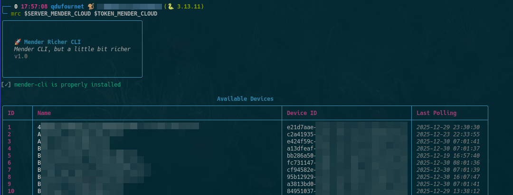
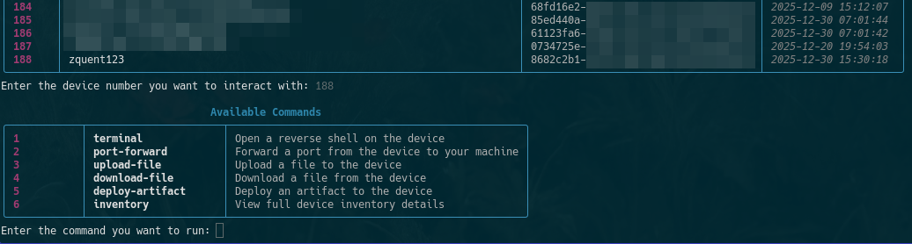
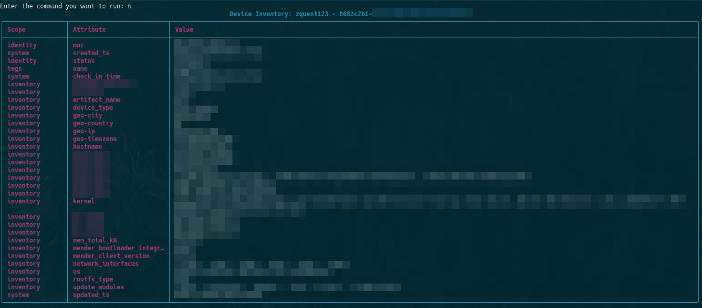
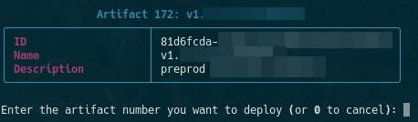

# mender-richer-cli

This is just mender-cli, but *richer*.

## Installation

```bash
git clone https://github.com/mcxiv/mender-richer-cli.git
cd mender-richer-cli
python3 -m pip install .
```

## Features

- ** Cool UI** - Very cool interface
- ** Device Management** - View and manage all your Mender devices
- ** Terminal Access** - Instantiate a reverse shell to any device
- ** Port Forwarding** - Forward ports from devices to your local machine
- ** File Upload** - Upload files to devices
- ** File Download** - Download files from devices
- ** Artifact Deployment** - Deploy artifacts to devices
- ** Device inventory** - Show full device inventory

## Usage

```bash
mrc --help

usage: mrc [-h] [--insecure] [--debug] server token

A richer CLI for Mender

positional arguments:
  server      Mender server URL
  token       Mender API token

options:
  -h, --help  show this help message and exit
  --insecure  Disable SSL certificate verification (not recommended for production)
  --debug     Enable debug logging
```

## Example








