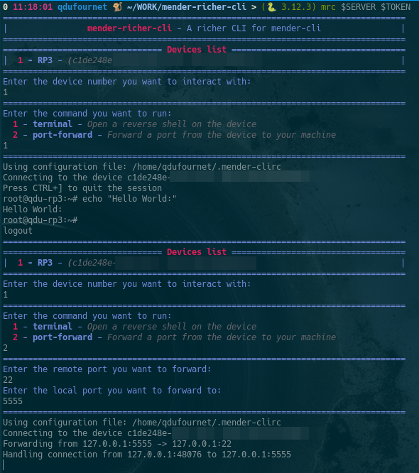

# mender-richer-cli

This is just mender-cli, but *richer*.

## Installation

```bash
git clone https://github.com/mcxiv/mender-richer-cli.git
cd mender-richer-cli
python3 -m pip install .
```

## Features

- **terminal** - *Instanciate a reverse shell to the device*
- **port-forward** - *Forward a port from the device to the host*

## Usage

```bash
mrc --help

usage: mrc [-h] server token

A richer CLI for Mender

positional arguments:
  server      Mender server URL
  token       Mender API token

options:
  -h, --help  show this help message and exit
```

## Example

